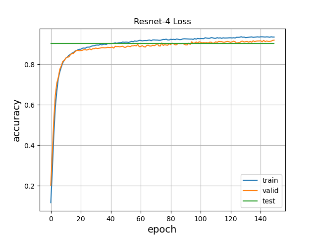
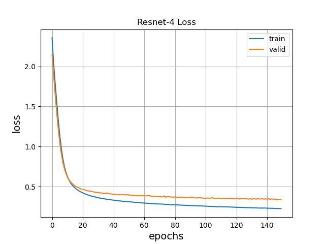

# Custom-Resnet-4-model-for-MNIST

## Overview
This repository contains the implementation of a Resnet-4 model designed specifically for the MNIST number dataset. Residual Networks (ResNet) are a type of deep neural network architecture introduced by Kaiming He et al. in 2015. The primary innovation in ResNet is the introduction of "skip connections" or "shortcuts" that allow the network to skip layers during forward and backward passes. This helps in preventing the vanishing gradient problem, making it feasible to train very deep networks.

The number in the ResNet name (e.g., ResNet-4, ResNet-30) indicates the total number of weighted layers in the network. In this context **ResNet-4** contains 4 weighted layers, including 3 convolutional layers and 1 dense layer. It's a simplified version, making it faster and suitable for datasets like MNIST which might not require very deep architectures.

For the MNIST number dataset, our Resnet-4 model leverages the power of residual networks to achieve high accuracy on the task of handwritten digit recognition, while ensuring efficient training and inference times.

Below, you can see the structure of the model.

```
__________________________________________________________________________________________________
 Layer (type)                Output Shape                 Param #   Connected to                  
==================================================================================================
 Input_1 (InputLayer)        [(None, 28, 28, 1)]          0         []                            
                                                                                                  
 conv_11 (Conv2D)            (None, 28, 28, 5)            50        ['Input_1[0][0]']             
                                                                                                  
 conv_12 (Conv2D)            (None, 28, 28, 5)            230       ['conv_11[0][0]']             
                                                                                                  
 add (Add)                   (None, 28, 28, 5)            0         ['conv_12[0][0]',             
                                                                     'Input_1[0][0]']             
                                                                                                  
 max_pooling2d (MaxPooling2  (None, 14, 14, 5)            0         ['add[0][0]']                 
 D)                                                                                               
                                                                                                  
 conv2d (Conv2D)             (None, 14, 14, 5)            230       ['max_pooling2d[0][0]']       
                                                                                                  
 add_1 (Add)                 (None, 14, 14, 5)            0         ['conv2d[0][0]',              
                                                                     'max_pooling2d[0][0]']       
                                                                                                  
 flatten (Flatten)           (None, 980)                  0         ['add_1[0][0]']               
                                                                                                  
 dense (Dense)               (None, 10)                   9810      ['flatten[0][0]']             
                                                                                                  
==================================================================================================
Total params: 10320 (40.31 KB)
Trainable params: 10320 (40.31 KB)
Non-trainable params: 0 (0.00 Byte)
__________________________________________________________________________________________________
```


## Model Performance Metrics

In this section, we present the key performance metrics of our machine learning model, as evaluated on both the training and validation datasets. These metrics provide insights into the model's ability to learn and generalize from the data.

### Accuracy and Loss

The following graphs depict the accuracy and loss trends for both the training and validation datasets:

Accuracy Graph: The green horizontal line on the accuracy graph represents a 90% accuracy threshold. It is noteworthy that both the training and validation sets surpass this threshold, indicating that the model performs well in terms of classification accuracy.

Overfitting Observation: However, it's essential to be aware of a potential issue with overfitting. As shown in the graphs, there is a noticeable divergence between the training and validation accuracy curves. This indicates that the model may be fitting the training data too closely, which can lead to reduced generalization performance on unseen data. Monitoring and mitigating overfitting should be a priority in further model development.

By closely examining these performance metrics, we can gain a better understanding of our model's strengths and weaknesses, enabling us to make informed decisions for further optimization and refinement.




